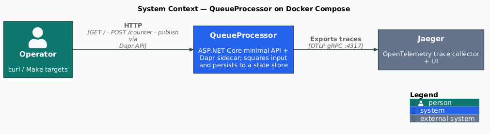
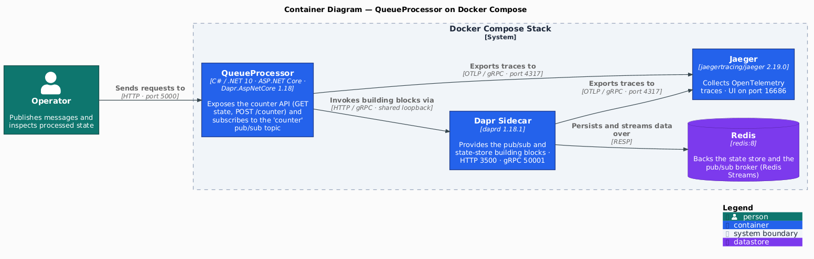
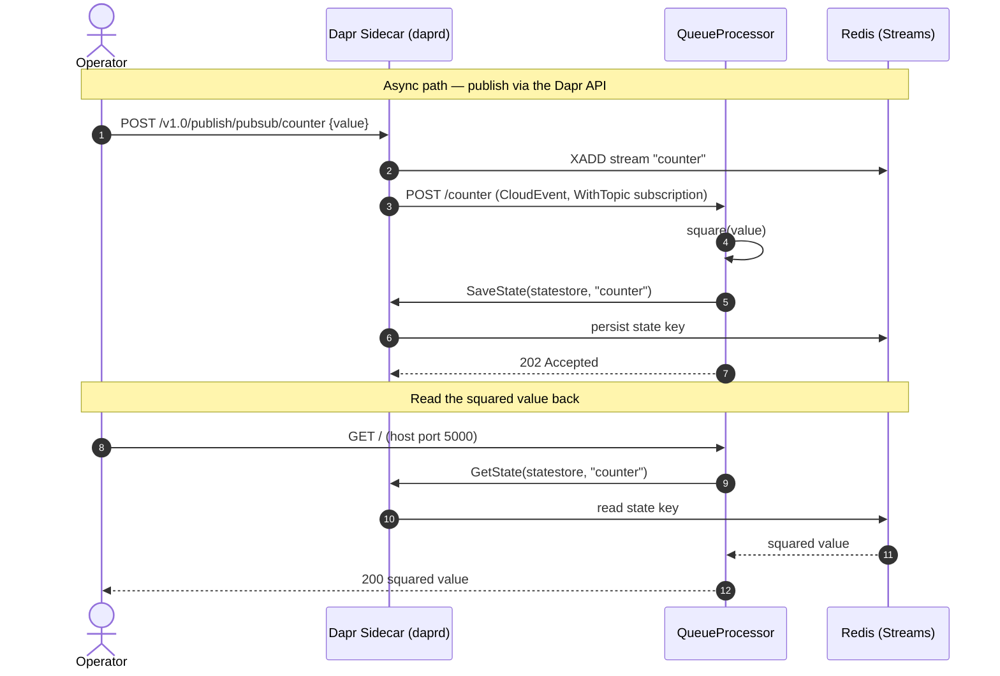

[](https://github.com/AndriyKalashnykov/dapr-docker-csharp/actions/workflows/ci.yml)
[](https://hits.sh/github.com/AndriyKalashnykov/dapr-docker-csharp/)
[](https://opensource.org/licenses/MIT)
[](https://app.renovatebot.com/dashboard#github/AndriyKalashnykov/dapr-docker-csharp)

# Production-Pattern C# Microservice on Dapr + Docker Compose

**Runtime surface:** ASP.NET Core minimal-API subscriber wired to a Dapr sidecar (`Dapr.AspNetCore`) for pub/sub on Redis Streams via `MapSubscribeHandler` + CloudEvents and Dapr state on Redis, with `OpenTelemetry.Extensions.Hosting` exporting OTLP traces to Jaeger and an `AddHealthChecks()`-backed `/healthz` endpoint probed by both the Dockerfile HEALTHCHECK and a compose-level healthcheck. **Delivery surface:** three-layer test pyramid (TUnit + FakeItEasy unit · TUnit + Testcontainers Redis+daprd integration · bash/curl e2e through Docker Compose covering pub/sub roundtrip and Jaeger trace ingestion), composite `make static-check` (`dotnet format --verify-no-changes` · `-warnaserror` · NuGet `--vulnerable` audit · Trivy filesystem scan · gitleaks · `minlag/mermaid-cli` Mermaid lint · `plantuml/plantuml` C4-diagram render drift gate), multi-stage production Dockerfile (non-root `app:app`, BuildKit-ARG-tunable HEALTHCHECK), GitHub Actions CI with `dorny/paths-filter` changes detector + `ci-pass` aggregator + `jdx/mise-action` toolchain bootstrap, `.env.example`-driven parameter externalization, mise-pinned auxiliary toolchain (Node, pnpm, jq, act, trivy, gitleaks), and Renovate-managed deps with `automergeType: pr` covering NuGet + Dockerfile + docker-compose + GitHub Actions + mise + custom-regex (Makefile + C# annotations).

## Tech Stack

| Component | Technology |
|-----------|------------|
| Language | C# / .NET 10.0 LTS (SDK 10.0.301 via `global.json`, `rollForward: latestFeature`) |
| Framework | ASP.NET Core (`Microsoft.NET.Sdk.Web`), `Dapr.AspNetCore` 1.18 |
| Messaging | Dapr pub/sub on Redis Streams |
| State store | Dapr state on Redis |
| Tracing | OpenTelemetry → Jaeger via `OpenTelemetry.Extensions.Hosting` 1.16 (OTLP gRPC) |
| Unit / integration testing | TUnit 1.58 + `WebApplicationFactory` + Testcontainers 4.13 (Redis + daprd) |
| Mocking | FakeItEasy 9.0 |
| E2E testing | Docker Compose + bash curl harness + Dapr publish API |
| Container runtime | Docker Compose v2; production multi-stage `src/queue-processor/Dockerfile` (non-root `app:app`, BuildKit-ARG HEALTHCHECK) |
| Static analysis | `dotnet format`, `dotnet build -warnaserror`, `dotnet list package --vulnerable`, Trivy filesystem scan, gitleaks, mermaid-cli |
| CI | GitHub Actions (changes → static-check → build/image-build/test/integration-test → e2e → ci-pass), `dorny/paths-filter` + `jdx/mise-action` |
| Dependency mgmt | Renovate (`automergeType: pr`, squash) — covers NuGet + Dockerfile + docker-compose + GitHub Actions + mise + custom-regex |
| Version manager | mise (`.mise.toml` pins Node, pnpm, jq, act, trivy, gitleaks) |

## Quick Start

```bash
make deps       # verify .NET SDK + Docker, bootstrap mise
make build      # build the solution
make start      # start all services (app + Dapr sidecar + Redis + Jaeger)
make dapr-logs  # follow queue processor logs
make dapr-pub   # publish a test message
```

## Prerequisites

| Tool | Version | Purpose |
|------|---------|---------|
| [GNU Make](https://www.gnu.org/software/make/) | 3.81+ | Build orchestration |
| [Git](https://git-scm.com/) | 2.0+ | Version control |
| [.NET SDK](https://dotnet.microsoft.com/download) | 10.0 | C# runtime and compiler (pinned in `global.json`) |
| [Docker](https://www.docker.com/) | latest | Container runtime with Compose v2 |
| [mise](https://mise.jdx.dev/) | latest | Polyglot version manager (Node, pnpm, jq, act, trivy, gitleaks per `.mise.toml`) |
| [jq](https://jqlang.github.io/jq/) | 1.8.x | API response formatting (auto-installed by `make deps` via mise) |

Install required tools (idempotent — verifies .NET / Docker, bootstraps mise, installs `.mise.toml` tools):

```bash
make deps
```

## Architecture

### System Context

<p align="center"></p>

An operator drives the system over HTTP — direct `POST /counter` and `GET /`, plus publishes through the Dapr publish API. Both the QueueProcessor and its Dapr sidecar export OpenTelemetry traces to Jaeger.

### Container Diagram

<p align="center"></p>

Component highlights:

- **QueueProcessor** — ASP.NET Core minimal API subscribing to the `counter` Dapr pub/sub topic via Redis Streams. Squares incoming integers and persists to the state store. Exposes `/healthz` (used by both Dockerfile HEALTHCHECK and the compose-level healthcheck). Emits OTLP traces via `OpenTelemetry.Extensions.Hosting`.
- **Dapr Sidecar** — `daprio/daprd` configured with `pubsub` (Redis Streams) and `statestore` (Redis) components; trace export wired through the Dapr `Configuration` CR.
- **Redis** — single broker handling both pub/sub backbone and state-store backing.
- **Jaeger** — OTLP trace collector reachable on the `dapr-demo-network`. Both the .NET app and the Dapr sidecar export to `jaeger:4317`. UI at `http://localhost:16686`.

### Message Flow — pub/sub roundtrip

`POST /counter` is served two ways by the **same handler**: a direct HTTP call, and a Dapr pub/sub subscription (`WithTopic("pubsub", "counter")`). Publishing through the Dapr API drives the async path below; a subsequent `GET /` reads the squared value back from the state store.



Docker Compose files:

- `docker-compose.yaml` — app service (dev SDK image + `dotnet watch`), Redis, compose-level `healthcheck:` against `/healthz` (host port via `HOST_PORT`, defaults to 5000)
- `compose/dapr-docker-compose.yaml` — Dapr sidecar, Jaeger (on `dapr-demo-network` so `jaeger:4317` resolves from both app and sidecar)
- `e2e/docker-compose.e2e.override.yaml` — strips internal-only host port bindings for parallel-safe e2e

Production deployments build the image from `src/queue-processor/Dockerfile` (multi-stage; runtime image is `mcr.microsoft.com/dotnet/aspnet:10.0` with a non-root `app:app` user and a `HEALTHCHECK` directive against `/healthz`). Build with `make image-build`.

Diagram sources live in `docs/diagrams/` — C4 diagrams as PlantUML (`c4-context.puml`, `c4-container.puml`), the message flow as inline Mermaid above. Regenerate the PlantUML PNGs with `make diagrams`; `make diagrams-check` (wired into `make static-check`) fails CI if a committed PNG drifts from its source.

## Environment Configuration

`.env.example` (committed) declares every operator-tunable with a default — host port, app internal port, OTel exporter endpoint, Dapr publish port, pub/sub names, Jaeger query host:port, healthcheck cadence (image-level + compose-level), e2e timeouts and poll intervals, act ephemeral port range. Copy to `.env` (gitignored) for local overrides. `docker compose` auto-loads `.env`; the Makefile uses `?=` defaults; `e2e/e2e-test.sh` sources both files; integration tests read sidecar ports (`DAPR_HTTP_PORT`, `DAPR_GRPC_PORT`) via `Environment.GetEnvironmentVariable` with matching defaults.

## Testing

Three-layer pyramid:

| Layer | Where | Real dependencies | Command |
|-------|-------|-------------------|---------|
| Unit | `tests/queue-processor.tests/EndpointTests.cs` (TUnit + `WebApplicationFactory` + FakeItEasy-mocked `DaprClient`) | none — in-process | `make test` |
| Integration | `tests/queue-processor.integration.tests/{StateStoreIntegrationTests,EndpointsIntegrationTests,SubscriptionContractTests}.cs` (TUnit + Testcontainers Redis + daprd container, real `DaprClient` over HTTP/gRPC; `SubscriptionContractTests` asserts the `/dapr/subscribe` wire shape in-process) | Redis + daprd via Testcontainers (none for the subscription contract test) | `make integration-test` |
| E2E | `e2e/e2e-test.sh` (curl + Dapr publish API against the full Docker Compose stack; asserts POST `/counter` status + `Location` header + body, pub/sub roundtrip, and Jaeger service registration + at least one recorded trace) | Full compose stack: app + daprd + Redis + Jaeger | `make e2e` |

## Available Make Targets

Run `make help` to see all targets.

### Build & Run

| Target | Description |
|--------|-------------|
| `make build` | Build the solution |
| `make image-build` | Build the production Docker image (multi-stage, non-root, HEALTHCHECK) |
| `make test` | Run unit tests (TUnit, mocked DaprClient) |
| `make integration-test` | Run integration tests against real Dapr + Redis (Testcontainers) |
| `make e2e` | Run end-to-end tests via Docker Compose (full stack incl. pub/sub roundtrip) |
| `make lint` | Check code formatting + warnaserror build |
| `make vulncheck` | Check for vulnerable NuGet packages |
| `make trivy-fs` | Trivy filesystem scan (vulns + misconfigs, HIGH/CRITICAL) |
| `make secrets` | Scan working tree + git history for committed secrets (gitleaks) |
| `make mermaid-lint` | Validate Mermaid diagrams in Markdown files |
| `make diagrams` | Render C4 PlantUML architecture diagrams to PNG |
| `make diagrams-check` | Verify committed diagram PNGs match their `.puml` source (drift gate) |
| `make diagrams-clean` | Remove rendered diagram artefacts |
| `make static-check` | Composite quality gate (lint + vulncheck + trivy-fs + secrets + mermaid-lint + diagrams-check) |
| `make format` | Auto-fix code formatting |
| `make clean` | Remove build artifacts |
| `make run` | Run the application locally |

### Docker Compose

| Target | Description |
|--------|-------------|
| `make start` | Start Docker Compose services |
| `make stop` | Stop Docker Compose services |
| `make restart` | Restart Docker Compose services |
| `make pull` | Pull latest Docker images |

### Dapr

| Target | Description |
|--------|-------------|
| `make dapr-logs` | Follow queue processor logs |
| `make dapr-pub` | Publish a message via Dapr pub/sub |
| `make dapr-counter` | Increment counter via API |
| `make dapr-get` | Get current state via API |

### Redis

| Target | Description |
|--------|-------------|
| `make redis-pending` | Show pending Redis stream messages (via compose-running container) |
| `make redis-clear` | Clear Redis stream messages (via compose-running container) |
| `make redis-monitor` | Monitor Redis commands (via compose-running container) |

### CI & Utilities

| Target | Description |
|--------|-------------|
| `make help` | List available tasks |
| `make ci` | Run full local CI pipeline (static-check + test + integration-test + build) |
| `make ci-run` | Run GitHub Actions workflow locally using [act](https://github.com/nektos/act) |
| `make deps` | Install required tools (idempotent) |
| `make deps-act` | Install act for local CI runs |
| `make renovate-bootstrap` | Install Node + pnpm via mise |
| `make renovate-validate` | Validate Renovate configuration |
| `make release` | Create and push a new tag |

## CI/CD

GitHub Actions runs on every push to `main`, tags `v*`, pull requests, `workflow_call`, and `workflow_dispatch`.

| Job | Triggers | Steps |
|-----|----------|-------|
| **changes** | every run | `dorny/paths-filter` short-circuits doc-only changes |
| **static-check** | code change or tag push | `make static-check` (lint + vulncheck + trivy-fs + secrets + mermaid-lint + diagrams-check) |
| **build** | after static-check | `make build` |
| **image-build** | after static-check | `make image-build` (build-only Dockerfile validation, no push) |
| **test** | after static-check | `make test` (unit) |
| **integration-test** | after static-check | `make integration-test` (Testcontainers Redis + daprd) |
| **e2e** | after build + test | `make e2e` (Docker Compose full-stack roundtrip) |
| **ci-pass** | always | Aggregator status check for branch protection / Rulesets |

### Required Secrets and Variables

Only the auto-provided `GITHUB_TOKEN` is used. No additional secrets are required.

A separate cleanup workflow (`.github/workflows/cleanup-runs.yml`) prunes old workflow runs (retains 7 days / minimum 5) and stale branch caches weekly.

[Renovate](https://docs.renovatebot.com/) keeps dependencies up to date with PR automerge (squash strategy) enabled.
